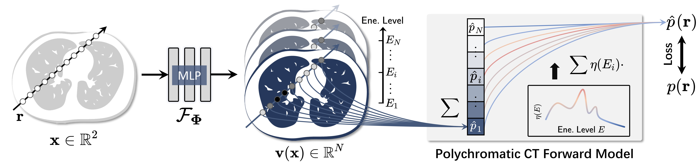

# Polyner

This repository is the official implementation of our NeurIPS 2023 paper "*Unsupervised Polychromatic Neural Representation for CT Metal Artifact Reduction*" [[OpenReview](https://openreview.net/forum?id=xx3QgKyghS)], [[arXiv](https://arxiv.org/abs/2306.15203)]


*Fig. 1: Overview of the proposed Polyner model.*

## 1. Visualization


*Fig. 2: Qualitative results of FBP and our polyner on 2D fan-beam samples of DeepLesion simulation dataset.*


*Fig. 3: Qualitative results of FDK and our polyner on a real-world 3D cone-beam mouse thigh sample.*
## 2. File Tree
```
Polyner
│  config.json					# configuration script.
│  dataset.py					# dataloader
│  eval.py			   		# quantitative evaluation
│  main.py					# running script for training
│  model.py					# EAS loss
│  readme.md					# readme file
│  Polyner.py					# training function
│  utils.py					# tools
│  
├─data_simulation				# data simulation
│  │  config_dl.yaml				# acquisition parameters
│  │  dl_data.m					# running script for DeepLesion dataset
│  │  
│  ├─+helper					# functions for data simulation
│  │      get_mar_params.m
│  │      interpolate_projection.m
│  │      pkev2kvp.m
│  │      simulate_metal_artifact.m
│  │              
│  ├─metal					# prior data for simulation
│  │      
│  └─slice
│          gt_x.nii				# raw data
│      
├─input
│      fanSensorPos.nii				# geometry angle
│      GE14Spectrum120KVP.mat			# energy spectrum
│      gt_x.nii					# gt image
│      mask_x.nii				# metal mask
│      ma_x.nii					# FBP reconstructions
│      ma_sinogram_x.nii			# metal-corrupted measurements
│      
├─model
│      model_x.pkl				# pre-trained Polyner
│      
└─output
        polyner_x.nii				# Polyner reconstructions
```

## 3. Main Requirements
To run this project, you will need the following packages:
- PyTorch 3.8.13
- tinycudann
- SimpleITK, tqdm, numpy, and other packages.

## 4. Training and Checkpoints

To train our Polyner from scratch, navigate to `./` and run the following command in your terminal:
```shell
python main.py
```
This will train the Polyner model for the metal-corrputed sinogram (`./input/ma_sinogram_0~9.nii`). The well-trained model will be stored in `./model` and its corresponding MAR results will be stored in `./output`.

## 5. Evaluation

To qualitatively evalute the result, navigate to `./` and run the following comman in your terminal:
```shell
python eval.py
```
This will compute PSNR and SSIM values of FBP and our Polyner on the ten samples of the DeepLesion dataset.

For the ten sinograms (`./input/ma_sinogram_0~9.nii`), the quantitative results are shown in:

|Method         | PSNR  | SSIM |
|:------------------: |:--------------: | :------------: |
|FBP   | 29.13±3.27 | 0.7201±0.1109 |
|Polyner   | 37.33±0.93 | 0.9774±0.0031 |

## 6. Data Simulation
To simulate the metal-corrupted measurements, navigate to `./data_simulation` and run the MATLAB script `dl_data.m`. These code for data simulation are based on the ADN repository: https://github.com/liaohaofu/adn/tree/master


## 7. Others

NIFTI files (`.nii`) can be viewed by using the ITK-SNAP software, which is available for free download at: http://www.itksnap.org/pmwiki/pmwiki.php?n=Downloads.SNAP4


## 8. License

This code is available for non-commercial research and education purposes only. It is not allowed to be reproduced, exchanged, sold, or used for profit.

## 9. Citation

If you find our work useful in your research, please cite:
```
@inproceedings{
wu2023unsupervised,
title={Unsupervised Polychromatic Neural Representation for {CT} Metal Artifact Reduction},
author={Qing Wu and Lixuan Chen and Ce Wang and Hongjiang Wei and S Kevin Zhou and Jingyi Yu and Yuyao Zhang},
booktitle={Thirty-seventh Conference on Neural Information Processing Systems},
year={2023},
url={https://openreview.net/forum?id=xx3QgKyghS}
}
```
